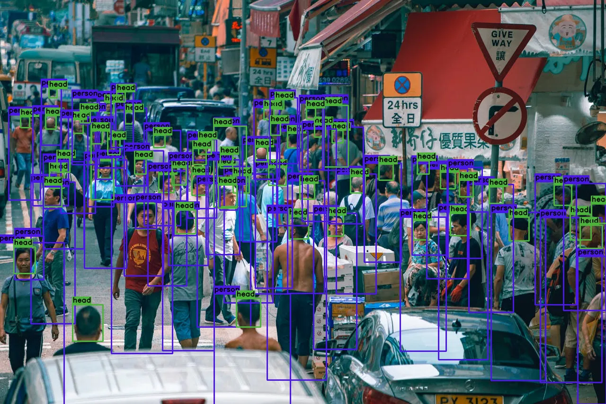
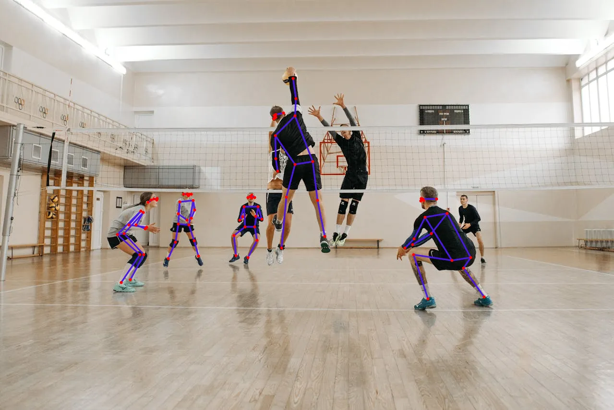
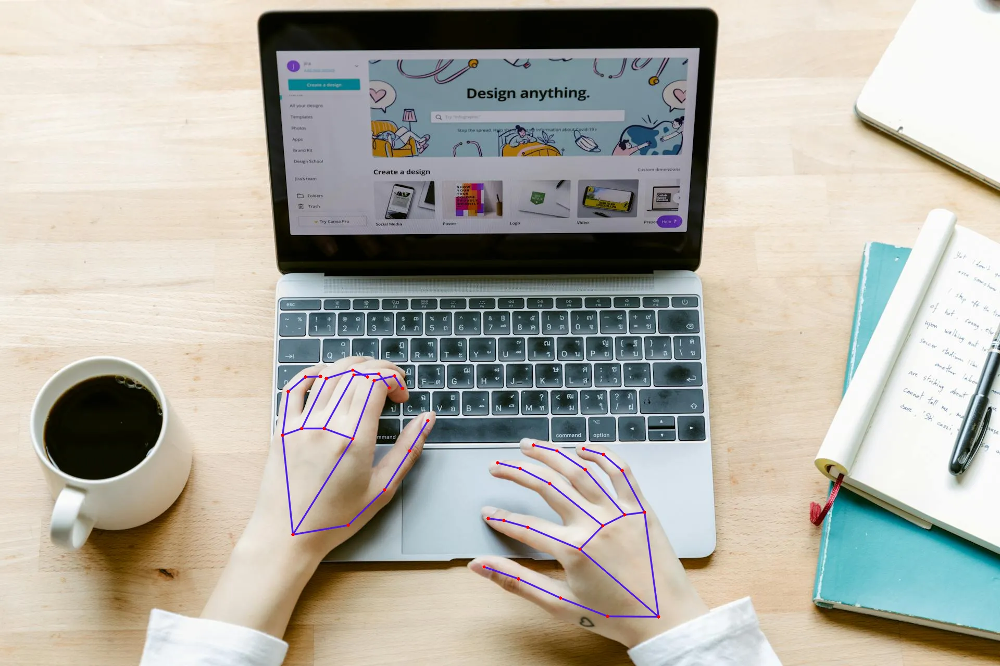
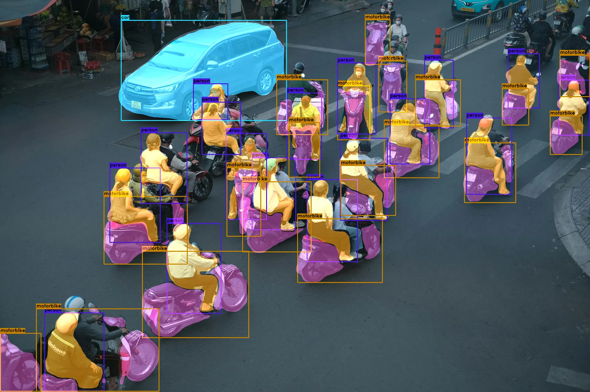
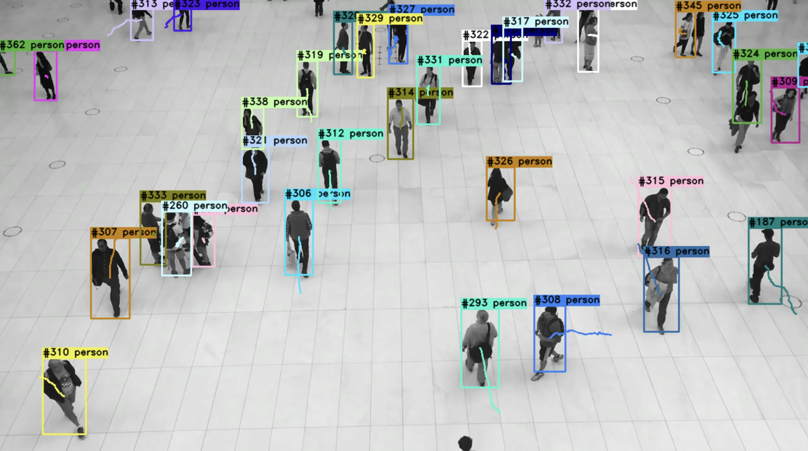

# Documentation

This documentation is intended to provide a conceptual overview of the framework. It focuses less on listing every API
surface and more on the ideas, abstractions, and usage patterns behind visiongraph.

## Getting Started

### Structure

The visiongraph package structure contains the following main packages.

- `visiongraph.vg` - Provides lazy and optional access to the public API through a single package import.
- `visiongraph.input` - Contains input providers for various cameras and media sources, such as UVC webcams, Azure
  Kinect, RealSense and more.
- `visiongraph.estimator` - Implements machine-learning models and classical computer-vision algorithms.
- `visiongraph.result` - Contains the typed result models returned by estimators.
- `visiongraph.output` - Adds output nodes such as image preview and framebuffer sharing integrations.

Additionally, there are the following packages.

- `visiongraph.model` - Contains shared data models, geometry classes and parameter types used throughout visiongraph.
- `visiongraph.dsp` - Contains filters and DSP algorithms for temporal smoothing and signal processing.
- `visiongraph.recorder` - Adds support for frame and video recording using different backends.
- `visiongraph.tracker` - Contains object-detection tracker implementations.
- `visiongraph.data` - Contains abstractions for downloading and managing external model assets.
- `visiongraph.node` - Contains helper nodes used to compose more complex graphs.

### Import Visiongraph

There are two common ways to import visiongraph related objects and classes. The classical way is to use a direct
import:

```python
from visiongraph.estimator.openvino.OpenVinoEngine import OpenVinoEngine

engine = OpenVinoEngine(...)
```

However, because visiongraph contains many packages and some fairly deep module paths, it is usually more convenient to
use the `vg` package. It exposes all public modules and methods and lazily imports the requested object the first time
it is accessed.

```python
from visiongraph import vg

engine = vg.OpenVinoEngine(...)
```

#### Optional Imports

`vg` allows direct access to all public members of visiongraph and also handles optional imports. If an optional import
is not available, a stub type is returned which raises an error only when it is actually used. This makes it possible
to write cross-platform code even for SDKs that are not available on every operating system:

```python
from visiongraph import vg

device = ...

if isinstance(device, vg.AzureKinectInput):
    # safe even on platforms where Azure Kinect support is unavailable
    print("This is a Kinect")
```

### Graph Node

A `visiongraph.GraphNode.GraphNode` is a single processing unit and usually solves one specific task. However, the
philosophy of visiongraph is to provide a few practical, rich nodes instead of exposing every tiny operation as its own
node. Each node implements the `visiongraph.Processable.Processable` interface, which defines input and output types and
processes data in the `process(self, data: InputType) -> OutputType` method.

Since many algorithms and node implementations need to acquire and release resources (such as camera handles, GPU
memory, or native frameworks), `GraphNode` also defines the lifecycle methods `setup()` and `release()`. The usual way
to use a `visiongraph.GraphNode.GraphNode` directly is to create an instance, call `setup()`, use it, and finally call
`release()`.

Here is an example of a basic pose estimator:

```python
from visiongraph import vg

# create the instance of a pose estimator
mp_pose = vg.MediaPipePoseEstimator.create(vg.MediaPipePoseConfig.Light)

# prepare the necessary resources and start the estimator
mp_pose.setup()

# process a frame
result = mp_pose.process(my_np_image)

# release the resources
mp_pose.release()
```

#### Context Manager

Usually, the `setup()` and `release()` methods should not be called manually. Each node implements the
context-manager pattern and can be used like this, which helps ensure resources are cleaned up correctly.

```python
from visiongraph import vg

with vg.MediaPipePoseEstimator.create(vg.MediaPipePoseConfig.Light) as mp_pose:
    # process a frame
    result = mp_pose.process(my_np_image)
```

## Input

Since there are many cameras with different capture modes, visiongraph implements a basic abstraction for various
computer-vision inputs such as UVC webcams, RealSense, Azure Kinect, ZED, OAK, and simple media sources. This
abstraction is called `visiongraph.input.BaseInput.BaseInput` and allows you to `read()` from a specific device or
stream. In most cases the input is a camera, but it can also be an image, a video file, or another media source.

Here is an example of how to read frames from a camera. Be aware that `read()` returns a `timestamp` in milliseconds
and an optional camera image in `np.ndarray` format, usually as HWC and BGR.

```python
from visiongraph import vg

# create the camera instance but does not connect to the hardware
cam = vg.VideoCaptureInput()

# connects to the actual camera hardware
cam.setup()

# using the camera to read frames
running = True
while running:
    ts, frame = cam.read()
    if frame is None:
        running = False
        continue

    # do something with the frame

# release the camera handle
cam.release()
```

It is also possible to apply post-processing methods like `rotate`, `flip`, `mask` or `crop` by configuring them on the
`visiongraph.input.BaseInput.BaseInput`.

```python
from visiongraph import vg
import cv2

cam = vg.VideoCaptureInput()
cam.rotate = cv2.ROTATE_90_CLOCKWISE
cam.setup()
```

### Depth Camera

Since special cameras with multiple streams are common in computer vision, there is the
`visiongraph.input.BaseDepthCamera.BaseDepthCamera` abstraction. It covers cameras that provide color, infrared and
depth streams, such as RealSense, Azure Kinect or Luxonis OAK cameras. `BaseDepthCamera` adds support for reading each
stream either in raw format (as captured by the device) or in a pre-processed format that is more unified across depth
cameras.

```python
from visiongraph import vg

cam: vg.BaseDepthCamera = vg.AzureKinectInput()

# setup settings for the depth camera (like enabling the infrared and depth stream)
cam.use_infrared = True
cam.enable_depth = True

cam.setup()

# read() still returns just a single ts and frame (usually the default color stream)
ts, frame = cam.read()

# to read a depth frame, use the following properties
depth_image = cam.depth_image  # colorized np.uint8 frame (for preview)
raw_depth_image = cam.raw_depth_image  # raw depth values, often np.uint16, for processing
```

It is also possible to read a specific stream on demand by using the
`visiongraph.input.BaseDepthCamera.BaseDepthCamera.get_image()` method. In this context, `pre_processed` refers to the
image processing that happens directly inside the specific depth camera implementation (for example, the
`AzureKinectInput` normalizes the infrared image to a min/max value). `post_processed` enables the `rotate`, `flip`,
and other post-processing methods provided by `visiongraph.input.BaseInput.BaseInput`.

```python
from visiongraph import vg

with vg.AzureKinectInput() as cam:
    raw_infrared = cam.get_image(vg.CameraStreamType.Infrared, pre_processed=False, post_processed=False)
```

### Camera Intrinsics

For many computer-vision applications, camera intrinsics are essential. The
`visiongraph.input.BaseCamera.BaseCamera` adds methods that camera implementations can use to return camera intrinsics
per stream type, using the color stream by default.

```python
from visiongraph import vg

with vg.AzureKinectInput() as cam:
    infrared_intrinsics = cam.get_intrinsics(vg.CameraStreamType.Infrared)

    print(infrared_intrinsics.camera_matrix)
    print(infrared_intrinsics.distortion_coefficients)

    principal_point = infrared_intrinsics.px, infrared_intrinsics.py
    focal_point = infrared_intrinsics.fx, infrared_intrinsics.fy
```

### Settings

Usually, the input is configured between object initialization and the call to `setup()`. However, it is also possible
to control some camera parameters at runtime. A basic subset of controls for `gain`, `exposure`, and `white-balance`
is implemented in `visiongraph.input.BaseCamera.BaseCamera`.

```python
from visiongraph import vg

with vg.AzureKinectInput() as cam:
    cam.enable_auto_exposure = True
    cam.gain = 100
```

## Estimators / Detectors

An estimator is typically a graph node that takes an image as input and produces information about its content.
Examples include pose estimation or face detection. In some cases, the estimator may also transform the image itself,
for example by removing blur or generating a depth map.

### Object Detection


*Object detection example using [CrowdHuman](https://www.crowdhuman.org/) trained model.*

There are various implementations of object detectors in visiongraph, ranging from
[SSD](https://arxiv.org/abs/1512.02325) and [YOLO](https://arxiv.org/abs/1506.02640) (X, v5, v8, v8 OBB, etc.) to
face detectors and dedicated crowd detectors. Each object detector returns a list of typed results which can be used to
inspect, annotate, post-process or track the detected object instances.

```python
import numpy as np

from visiongraph import vg

face_image: np.ndarray

with vg.MediaPipeFaceDetector() as face_detector:
    results: vg.ResultList[vg.FaceDetectionResult] = face_detector.process(face_image)

    for face in results:
        print(face.class_id)
        print(face.class_name)
        print(face.score)
        print(face.bounding_box)

    # simply annotate the faces on the image
    results.annotate(face_image)
```

Since machine-learning frameworks usually need specific model files, weight files and runtime settings, visiongraph
already provides a list of configurations for many detectors. These configurations are available when the corresponding
models and weights are hosted in the repository (see [assets](#assets)). Here are some examples:

```python
from visiongraph import vg

# face detector with config
with vg.AdasFaceDetector.create(vg.AdasFaceConfig.MobileNet_672x384_FP32) as face_detector:
    pass

# generic YOLOv8 object detector with config
with vg.YOLOv8Detector.create(vg.YOLOv8Config.YOLOv8_N) as detector:
    pass

# mask RCNN estimator for instance segmentation tasks
with vg.MaskRCNNEstimator.create(vg.MaskRCNNConfig.EfficientNet_480_INT8) as segmenter:
    pass
```

#### Non-Maximum-Suppression ([NMS](https://learnopencv.com/non-maximum-suppression-theory-and-implementation-in-pytorch/))

Most object-detection models need a post-processing step called non-maximum suppression to remove overlapping bounding
boxes that describe the same object more than once.

```python
from visiongraph import vg

results = [vg.ObjectDetectionResult(...), ...]
vg.non_maximum_suppression(results, batched=True)
```

It is possible to either run NMS over all object-detection results, or make it class-aware (`batched`). By default, it
is not class-aware. Usually, estimators also allow a `visiongraph.model.NMSOptions.NMSOptions` object to configure
their internal NMS call.

### Human Pose Estimator

Human pose estimation is very common in interactive systems and can be seen as a specialized spatial detection task.
That is why visiongraph models pose estimation as a
`visiongraph.estimator.spatial.ObjectDetector.ObjectDetector`, but extends the result objects with additional methods to
work with landmarks (keypoints).


*[KAPAO](https://github.com/wmcnally/kapao) based pose estimation example.*

```python
import numpy as np

from visiongraph import vg

pose_image: np.ndarray

with vg.AEPoseEstimator.create() as pose_detector:
    results = pose_detector.process(pose_image)
    for pose in results:
        eye = pose.left_eye
        print(f"Eye Position: {eye.x}, {eye.y}")
        print(f"Landmark count: {len(pose.landmarks)}")
```

There are various pose models implemented. For many real-time applications, the MediaPipe pose model is a good default
because it is very efficient. Here is a selection of available models.

```python
from visiongraph import vg

vg.MediaPipePoseEstimator.create(vg.MediaPipePoseConfig.Light)
vg.AEPoseEstimator.create(vg.AEPoseConfig.EfficientHRNet_288_FP16)
vg.KAPAOPoseEstimator.create(vg.KAPAOPoseConfig.KAPAO_S_COCO_640)
vg.UltralyticsPoseEstimator.create(vg.UltralyticsPoseConfig.YOLOv8_N_640_INT8)
vg.LiteHRNetPoseEstimator.create(vg.LiteHRNetConfig.LiteHRNet_30_COCO_384x288_FP16)
vg.MoveNetPoseEstimator.create(vg.MoveNetConfig.MoveNet_MultiPose_320x320_FP32)
vg.OpenPoseEstimator.create(vg.OpenPoseConfig.LightWeightOpenPose_INT8)
```

Since pose datasets do not all use the same landmark set, there is a generic
`visiongraph.result.spatial.pose.PoseLandmarkResult.PoseLandmarkResult` which exposes default landmarks shared across
the common pose definitions (COCO, BlazePose, OpenPose, etc.). Concrete result types may also expose additional,
dataset-specific landmarks.

```python
from visiongraph import vg

result: vg.COCOOpenPose

result.nose
result.neck
result.left_knee
result.right_knee

# and so on
```

### Hand Estimator

Similar to the human pose estimators, there are also estimators for hand-pose detection. They return a list of
landmarks for each detected hand and can be used together with human pose estimation in more holistic pipelines.


*[MediaPipe Hand](https://ai.google.dev/edge/mediapipe/solutions/vision/hand_landmarker) estimation example.*

```python
import numpy as np

from visiongraph import vg

image: np.ndarray

with vg.MediaPipeHandEstimator() as network:
    results = network.process(image)

    for hand in results:
        if hand.handedness == vg.Handedness.LEFT:
            print(hand.index_finger_ip)
```

### Landmark Embeddings

For classification or re-identification tasks it can be useful to embed landmark results into a position- and
scale-invariant format (normalization). For that purpose there is already a predefined
`visiongraph.estimator.embedding.LandmarkEmbedder.LandmarkEmbedder`, which takes an embedding method and a list of pose
results.

```python
from visiongraph import vg

poses: list[vg.PoseLandmarkResult] = []

with vg.LandmarkEmbedder(vg.embed_pose) as model:
    embeddings = model.process(poses)
```

### Object Segmentation

Object-segmentation estimators not only predict the bounding box around an object, but also a pixel-based mask that
describes its visible shape.
`visiongraph.estimator.spatial.InstanceSegmentationEstimator.InstanceSegmentationEstimator` inherits
`visiongraph.estimator.spatial.ObjectDetector.ObjectDetector` and extends the object-detection results with a binary
mask.


*Instance segmentation example.*

```python
import numpy as np

from visiongraph import vg

image: np.ndarray

with vg.YOLOv8SegmentationEstimator.create() as model:
    results = model.process(image)

    for instance in results:
        mask: np.ndarray = instance.mask
```

Please note that the mask is a binary mask (containing only 0 or 1) and is of type `np.uint8`. The size of the
mask is the same as the input frame, which can become memory-intensive when many instances are detected.

### Camera Pose Estimator

At the moment, only a few tools are implemented for camera calibration and pose estimation. One of them is the
`visiongraph.estimator.spatial.camera.ArUcoCameraPoseEstimator.ArUcoCameraPoseEstimator` which requires camera
intrinsics to detect ArUco markers and predict the relative camera pose.

```python
import numpy as np

from visiongraph import vg

intrinsics = vg.CameraIntrinsics.load("media/calibration.json")
image: np.ndarray

with vg.ArUcoCameraPoseEstimator(
        camera_matrix=intrinsics.intrinsic_matrix, fisheye_distortion=intrinsics.distortion_coefficients
) as model:
    pose = model.process(image)
    print(f"Camera position: {pose.position} / rotation {pose.rotation}")
    print(f"Distance: {pose.position.mag:.2f}")
```

For creating an intrinsic camera calibration, have a look at
`visiongraph.estimator.spatial.camera.ChessboardCalibrator.ChessboardCalibrator` or
`visiongraph.estimator.spatial.camera.ChArUcoCalibrator.ChArUcoCalibrator`.

### Result

The result of an estimator is usually a `visiongraph.result.BaseResult.BaseResult` or a list of such objects. A result
object contains information about the detected object, such as the bounding box, score, class id and so on. It also
provides methods to annotate itself directly on an image.

```python
from visiongraph import vg

result: vg.ObjectDetectionResult

# access the bounding box
print(result.bounding_box)

# annotate the result on the image
result.annotate(image)
```

Since most estimators return multiple results, there is a `visiongraph.result.ResultList.ResultList` which inherits from
`list` and adds the `annotate` method to annotate all results in the list at once.

```python
from visiongraph import vg

results: vg.ResultList[vg.ObjectDetectionResult]

# annotate all results
results.annotate(image)
```

### Inference Engine

To support multiple machine-learning frameworks, visiongraph uses a generic inference-engine abstraction. The
`visiongraph.estimator.engine.InferenceEngineFactory.InferenceEngineFactory` allows an inference engine to be created
based on the available frameworks. The `visiongraph.estimator.BaseVisionEngine.BaseVisionEngine` is the base class for
all inference engines and provides a common interface for preprocessing inputs and running inference.

Currently, the following engines are supported:

- `ONNX` - Uses the ONNXRuntime to run ONNX models.
- `OpenVINO` - Uses the OpenVINO toolkit to run OpenVINO models.

Here is an example of how to use the inference engine factory:

```python
from visiongraph import vg

# run inference with the onnx engine
with vg.InferenceEngineFactory.create(
        vg.InferenceEngine.ONNX,
        assets=[vg.RepositoryAsset("model.onnx")]) as engine:
    result = engine.process(image)
```

## Tracker

Object-detection trackers allow a detected object to be assigned a `tracking_id` that remains the same across
successive frames. This is especially useful for counting objects or following a specific object over time.

### Flate Tracker

The `visiongraph.tracker.FlateTracker.FlateTracker` (Fast Localization and Tracking Engine) is a simple tracker that
uses a configurable cost function to match objects between frames. It is very fast and works well for many use cases.


*Object detection tracking example.*

```python
from visiongraph import vg

detections: list[vg.ObjectDetectionResult] = []

tracker = vg.FlateTracker()

# process the detections
tracked_results = tracker.process(detections)

for result in tracked_results:
    print(f"Track ID: {result.tracking_id} Staleness: {result.staleness}")

    # check if is stale
    if result.is_stale:
        pass
```

By default, the `tracking_id` attribute of an `visiongraph.result.spatial.ObjectDetectionResult.ObjectDetectionResult`
is initialized with `-1` to indicate that this object has never been tracked.

## Filter

To filter noisy estimations or inputs, the DSP package provides different filters which can be applied directly inside a
graph.

### One Euro Filter

The `visiongraph.dsp.OneEuroFilter.OneEuroFilter` is an implementation of the very popular
[OneEuro filter](https://gery.casiez.net/1euro/) for smoothing noisy signals. It is an adaptive low-pass filter that
minimizes jitter while keeping lag low. It is especially useful for smoothing pose-estimation results.

```python
from visiongraph import vg

value = 1

# create a filter for a single value (x0 is the start value)
one_euro_filter = vg.OneEuroFilter(x0=0, min_cutoff=1.0, beta=0.0)

# filter a value
filtered_value = one_euro_filter(value)
```

There are also implementations for numpy arrays (`visiongraph.dsp.OneEuroFilterNumpy.OneEuroFilterNumpy`) and numba
optimized versions (`visiongraph.dsp.OneEuroFilterNumba.OneEuroFilterNumba`).

### Landmark Smoothing

For smoothing landmark detections (like pose or hand landmarks), the
`visiongraph.dsp.LandmarkSmoothFilter.LandmarkSmoothFilter` can be used. It applies the OneEuro filter to each landmark
individually and handles the tracking IDs automatically.

```python
from visiongraph import vg

# create a landmark smooth filter
smoother = vg.LandmarkSmoothFilter(min_cutoff=1.0, beta=0.0)

# filter the landmarks
smoothed_results = smoother.process(results)
```

## Assets

Most estimators use large model and weight files for their neural networks. To keep visiongraph small and easy to
install, these assets are hosted externally and downloaded on demand. Visiongraph provides a system to directly
download and store these files locally.

By default, downloaded assets are stored in `~/.visiongraph/assets/`. This location can be overridden with the
`VISIONGRAPH_ASSET_DIR` environment variable.

```bash
# zsh / bash
export VISIONGRAPH_ASSET_DIR="$HOME/.cache/visiongraph-assets"

# cmd
set VISIONGRAPH_ASSET_DIR=%USERPROFILE%\\visiongraph-assets

# powershell
$env:VISIONGRAPH_ASSET_DIR="$HOME/.visiongraph/assets"
```

An asset is defined by the `visiongraph.data.Asset.Asset` interface. The most common implementation is the
`visiongraph.data.RepositoryAsset.RepositoryAsset` which downloads the asset from a repository URL.

```python
from visiongraph import vg

# create a repository asset
asset = vg.RepositoryAsset("model.onnx")

# prepare the asset (download if not exists)
asset.prepare()

# get the path to the asset
print(asset.path)
```

The default repository is located
at [huggingface.co/cansik/visiongraph](https://huggingface.co/cansik/visiongraph/tree/main). It is possible to change
the repository URL or add custom headers for authentication. Model provenance and license details for bundled and
repository-hosted assets are documented in [MODEL_ATTRIBUTIONS.md](MODEL_ATTRIBUTIONS.md). The visiongraph library code
is MIT-licensed, but individual downloadable models may be licensed differently, including copyleft licenses such as
AGPL or GPL.

## Utilities

### Recorder

To record incoming frames or annotated results, multiple frame recorders are provided. The
`visiongraph.recorder.BaseFrameRecorder.BaseFrameRecorder` is the base class for all recorders. Recorders can be used
inside a graph like any other node, but they can also be used directly.

```python
from visiongraph import vg

recorder = vg.CV2VideoRecorder(None, None, "output.mp4", fps=30)
recorder.open()
recorder.process(image)
recorder.close()
```

If `width` and `height` are `None`, `CV2VideoRecorder` initializes itself from the first frame it receives.

### Argparse

To support rapid prototyping, many graph and estimator options can be added directly to an argparse parser.
Please have a look at [Logging](#logging) or [Input](#input).

### Logging

To enable logging for visiongraph during the import phase, set the following environment variable before importing the
library:

```bash
# zsh / bash
export VISIONGRAPH_LOGLEVEL=INFO

# cmd
set VISIONGRAPH_LOGLEVEL=INFO

# powershell
$env:VISIONGRAPH_LOGLEVEL="INFO"
```

To add log-level support to argparse, use the following helper methods.

```python
from visiongraph import vg
import argparse

parser = argparse.ArgumentParser()
# add logging parameter to the parser
vg.add_logging_parameter(parser)
args = parser.parse_args()

# setup loglevel
vg.setup_logging(args.loglevel)
```

## Graph

The core component of visiongraph is
the [BaseGraph](https://github.com/cansik/visiongraph/blob/main/visiongraph/BaseGraph.py) class. It owns the node
lifecycle and runs the processing loop. A BaseGraph can run on the calling thread or optionally in a separate thread or
process. Conceptually, the graph itself is still a sequential chain of nodes; more complex data flow is created through
helper nodes such as `SequenceNode`, `ApplyNode`, `PassThroughNode`, `ExtractNode`, and `CustomNode`.

#### Graph Builder

The graph builder helps create new graphs in a compact and readable way. It creates a
[VisionGraph](https://github.com/cansik/visiongraph/blob/main/visiongraph/VisionGraph.py) object, which is a child of
BaseGraph. It offers `.then(...)` for sequential composition and `.apply(...)` for branching the current value into a
named result dictionary. The following code snippet shows a smooth pose-estimation graph.

```python
from visiongraph import vg

graph = (
    vg.create_graph(
        name="Smooth Pose Estimation",
        input_node=vg.VideoCaptureInput(0),
        handle_signals=True,
    )
    .apply(
        pose=vg.sequence(vg.OpenPoseEstimator.create(), vg.FlateTracker(), vg.LandmarkSmoothFilter()),
        image=vg.passthrough(),
    )
    .then(vg.ResultAnnotator(image_key="image"), vg.ImagePreview())
)
graph.open()
```

In this example, `image=vg.passthrough()` keeps the original frame, while the `pose` branch performs pose estimation,
tracking, and smoothing. `ResultAnnotator` then draws the pose results onto the image branch before `ImagePreview`
displays it.

## Extras

It is possible to install optional extras for visiongraph by specifying them during installation. Here is a list of the
currently supported extras:

- `realsense` - Support for Intel RealSense cameras
- `azure` - Support for Microsoft Azure Kinect cameras
- `depthai` - Support for the Luxonis cameras
- `openvino` - Support for the Intel OpenVINO machine-learning framework
- `mediapipe` - Support for the Google MediaPipe machine learning framework
- `onnx` - Support for the ONNX machine-learning framework (CPU)
- `onnx-gpu` - Support for the ONNX machine-learning framework (CUDA GPU)
- `onnx-directml` - Support for the ONNX machine-learning framework (DirectML GPU)
- `media` - Support for VidGear and MoviePy video reading and writing
- `numba` - Improved performance for smoothing and tracking algorithms
- `fbs` - Support for framebuffer sharing (SpoutGL or Syphon)
- `faiss` - Support for fast pose classification
- `mot` - Support for multi-object-tracking using motpy
