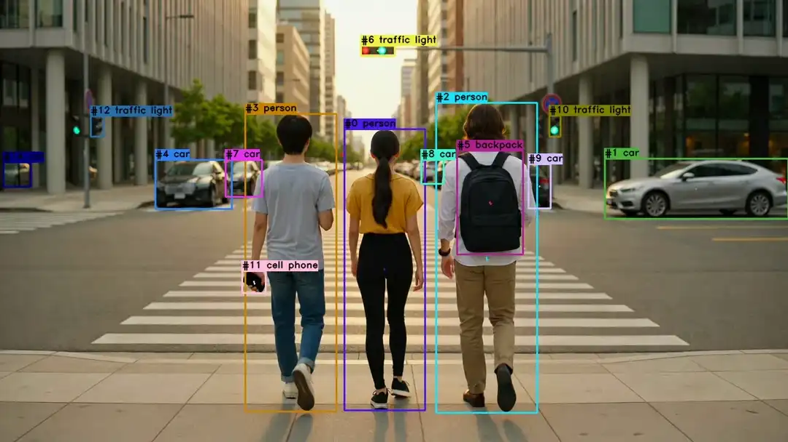

<picture>
  <source media="(prefers-color-scheme: dark)" srcset="https://github.com/user-attachments/assets/f30f10ef-8058-4306-882f-6301226107be">
  <source media="(prefers-color-scheme: light)" srcset="https://github.com/user-attachments/assets/0ed34695-ca0e-47ff-aebb-eb59ff851770">
  
</picture>

# Visiongraph

[](https://github.com/cansik/visiongraph/actions/workflows/code.yml)
[](https://pypi.org/project/visiongraph/)

[](https://cansik.github.io/visiongraph/visiongraph.html#documentation)

Visiongraph is a computer-vision pipeline library designed to simplify the prototyping of image-based algorithms with ready-to-use modules and composable graph nodes. Built on top of OpenCV, it also integrates popular frameworks such as [Intel OpenVINO](https://github.com/openvinotoolkit/openvino), [Google MediaPipe](https://github.com/google-ai-edge/mediapipe), and [DepthAI](https://pypi.org/project/depthai/). The library is designed with a focus on real-time applications and edge deployment.



*Object detection, segmentation and pose estimation example.*

Here is a minimal example that opens a live webcam capture, runs SSD object detection, and displays the annotated result.

```python
import cv2
from visiongraph import vg

with (vg.VideoCaptureInput() as cam,
      vg.SSDDetector.create(vg.SSDConfig.SSDLiteMobileNetV2_FP32) as ssd):
    while True:
        _, frame = cam.read()
        if frame is None:
            break

        results = ssd.process(frame)
        results.annotate(frame)

        cv2.imshow("Frame", frame)
        cv2.waitKey(1)
```

Get started with `visiongraph` by reading the **[documentation](https://cansik.github.io/visiongraph/visiongraph.html#documentation)**.

## Installation
Visiongraph supports Python 3.10, 3.11 and 3.12. Other versions may also work, but are not officially supported. In practice, version compatibility is usually limited by third-party dependencies rather than by visiongraph itself.

To install visiongraph with all available optional dependencies, use [pip](https://pypi.org/project/pip/) like this:

```bash
pip install "visiongraph[all]"
```

```bash
uv add "visiongraph[all]"
```

It is also possible, and usually preferable, to install only the extras you actually need:

```bash
# example: install RealSense and OpenVINO support only
pip install "visiongraph[realsense, openvino]"
```

Please read more about the extra packages in the [documentation](https://cansik.github.io/visiongraph/visiongraph.html#extras).

### Optional Mediapipe Support

Visiongraph can integrate Google’s [MediaPipe](https://github.com/google-ai-edge/mediapipe) for advanced hand, face, pose and tracking pipelines. Unfortunately, the official PyPI MediaPipe wheels declare a strict dependency on `numpy<2.0`, which prevents installation alongside NumPy 2.x, even though most functionality works fine with NumPy 2.0 and above. To work around this limitation, we maintain a custom [mediapipe-numpy2](https://github.com/cansik/mediapipe-numpy2) build that removes the `<2.0` pin.

When you install with the `mediapipe` extra, pip will automatically fetch the matching patched wheel for your OS and Python version.

#### Alternative: Use the Official MediaPipe Release

If you’re happy to stick with NumPy <2.0, you can skip our custom package entirely and install the upstream MediaPipe wheel from PyPI:

```bash
pip install visiongraph mediapipe
```

This installs Visiongraph together with the official `mediapipe` package, which requires `numpy<2.0`. Make sure your environment uses a NumPy version below 2.0 when choosing this route.

## Model Assets

Most estimators download their model files on demand and store them in `~/.visiongraph/assets/` by default. Set `VISIONGRAPH_ASSET_DIR` to use a different location.
Visiongraph itself is released under the MIT License, but individual downloadable models can use different licenses,
including copyleft terms such as AGPL or GPL. Check [MODEL_ATTRIBUTIONS.md](MODEL_ATTRIBUTIONS.md) for the license of
the specific model you plan to ship, redistribute, or use in a commercial product.


## Examples
To demonstrate the possibilities of visiongraph, the repository already contains a number of ready-to-run [examples](examples). Here is a selection of the current examples:

- [SimpleVisionGraph](examples/SimpleVisionGraph.py) - A minimal graph example for live object detection and tracking.
- [VisionGraphExample](examples/VisionGraphExample.py) - A face detection and tracking example with custom callbacks.
- [InputExample](examples/InputExample.py) - A basic input example that previews the stream and reports depth when available.
- [DepthCameraExample](examples/DepthCameraExample.py) - Display the depth map next to the color image for a supported depth camera.
- [FaceDetectionExample](examples/FaceDetectionExample.py) - A face detection pipeline example.
- [FindFaceExample](examples/FindFaceExample.py) - A face recognition example to find a target face.
- [CascadeFaceDetectionExample](examples/CascadeFaceDetectionExample.py) - A face detection pipeline that also predicts facial landmarks.
- [HandDetectionExample](examples/HandDetectionExample.py) - A hand detection pipeline example.
- [PoseEstimationExample](examples/PoseEstimationExample.py) - A pose estimation pipeline that annotates generic pose keypoints.
- [ProjectedPoseExample](examples/ProjectedPoseExample.py) - Project pose estimation into 3D space with a RealSense camera.
- [ObjectDetectionExample](examples/ObjectDetectionExample.py) - An object detection example.
- [InstanceSegmentationExample](examples/InstanceSegmentationExample.py) - Instance segmentation based on the COCO dataset.
- [InpaintExample](examples/InpaintExample.py) - A GAN-based inpainting example.
- [MidasDepthExample](examples/MidasDepthExample.py) - Real-time monocular depth prediction with the [midas-small](https://github.com/isl-org/MiDaS) network.
- [RGBDSmoother](examples/RGBDSmoother.py) - Smooth RGB-D depth map videos with a one-euro filter per pixel.
- [FaceMeshVVADExample](examples/FaceMeshVVADExample.py) - Detect voice activation by landmark sequence classification.

There are also additional projects that use visiongraph in practice:

- [Spout/Syphon RGB-D Example](https://github.com/cansik/spout-rgbd-example) - Share RGB-D images over Spout or Syphon.
- [NDI Input / Output](https://github.com/cansik/visiongraph-ndi) - Receive and share video frames over NDI.
- [WebRTC Input](https://github.com/cansik/visiongraph-webrtc) - WebRTC input example for visiongraph.

## Development
To develop visiongraph itself, clone this repository and install the dependencies with [uv](https://docs.astral.sh/uv/getting-started/installation/):

```bash
# from the repository root, install all dependencies
uv sync --all-extras --dev --group docs
```

### Build
To build a new wheel package of visiongraph, run the following command in the repository root. The generated wheel and source distribution will be placed in `./dist`.

```bash
make build
```

### Docs

To generate the documentation, use the following commands:

```bash
# create deployable documentation into "./docs"
make docs

# launch the local pdoc webserver
make docs-serve
```

### Linter

```bash
ruff format && ruff check --fix
```

## Dependencies

Parts of these libraries are directly included and adapted to work with visiongraph. For more information, please see the [third party notices](THIRD_PARTY_NOTICES.md).

Below is a list of visiongraph dependencies and their licenses, provided without guarantee of correctness:

```
depthai               MIT License
faiss-cpu             MIT License & BSD-3-Clause
filterpy              MIT License
mediapipe-numpy2      Apache License 2.0
moviepy               MIT License
numba                 BSD License
numpy                 MIT License
onnxruntime           MIT License
onnxruntime-directml  MIT License
onnxruntime-gpu       MIT License
opencv-python         Apache License 2.0
openvino              Apache License 2.0
pdoc                  MIT License
pyk4a                 MIT License
pyopengl              BSD License
pyrealsense2          Apache License 2.0
pyrealsense2-macosx   Apache License 2.0
pytest                MIT License
requests              Apache License 2.0
ruff                  MIT License
scipy                 MIT License
hatchling             MIT License
SpoutGL               BSD License
syphon-python         MIT License
tqdm                  MIT License
ty                    MIT License
vector                BSD License
vidgear               Apache License 2.0
wheel                 MIT License
```

For more information about the dependencies, see [pyproject.toml](pyproject.toml).

Please **note** that the library code is MIT-licensed, but some downloadable models, such as Ultralytics YOLOv8 and YOLOv11, use their own licenses (for example AGPLv3). Model provenance and license information is listed in [MODEL_ATTRIBUTIONS.md](MODEL_ATTRIBUTIONS.md).

## Credits

Developed at the [Immersive Arts Space](https://blog.zhdk.ch/immersivearts/),
[Zurich University of the Arts (ZHdK)](https://www.zhdk.ch/).  
Maintained by Florian Bruggisser.  

Released under the MIT License. See [LICENSE](LICENSE) for details.
